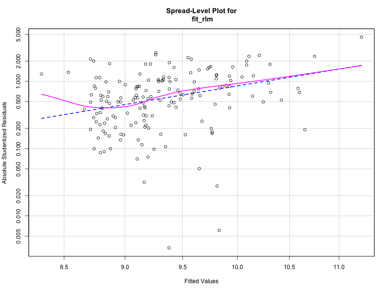

# Car Price Prediction using Multiple Linear Regression (Interpretability)

This project aims to model and predict car prices using robust multiple linear regression, emphasizing model interpretability and assumption diagnostics. The final model is able to estimate car prices with confidence intervals using bootstrap.

---

## 📁 Dataset

The dataset was obtained from UCI Irvine Machine Learning Repository and contains detailed specifications (engine, body, dimensions, fuel, etc.) for 205 cars.

- **Original source**: [Automobile](https://archive.ics.uci.edu/dataset/10/automobile)

---

## 👤 Author

**Diego Miranda**  
[GitHub Profile](https://github.com/DiegoMirandaDS)

---

## ⚙️ Feature Engineering and Variable Selection

Several transformations and modeling decisions were made to improve linear model assumptions and multicollinearity (after many iterations of the project):

- **Engine Type**:  
  The original `engine_type` variable had 6 categories, but some of them had very few observations, which made them unreliable for statistical modeling.  
As shown in the distribution plot below, the data was highly imbalanced:

  To address this and improve model stability, we grouped the engine types into a binary feature: `engine_class_performance`, representing *economy* vs *performance* engines.  
Both versions—6-class and 2-class—showed statistically significant effects on price according to ANOVA, confirming that the simplified version retained meaningful explanatory power (F = 41.33, p < 0.001).

- **Fuel Type**:  
  Although the ANOVA test for `fuel_type` did not show a statistically significant difference in mean log-price (p > 0.05), we decided to include it in the model based on domain knowledge. Fuel type is commonly associated with performance and efficiency tradeoffs, which could influence market value. Therefore, it was retained for its potential explanatory relevance, even if not supported by statistical evidence alone (which turned out to be a good decision).

- **Power Efficiency**:  
  A new feature, `power_efficiency = horsepower / citympg`, was created to capture the tradeoff between performance and efficiency. This helped reduce multicollinearity and normality assumption.

**Curbweight**:  
  This variable, which represents the vehicle’s curb weight (its weight when empty), proved to be one of the most important predictors across multiple iterations of the project. It consistently ranked high during feature selection procedures such as LASSO regression.  
However, its inclusion in the model affected the normality of residuals, so a logarithmic transformation was applied to stabilize variance and improve model assumptions.

- **Transformations**:
  - Target variable `price` was log-transformed to improve residual normality.
  - `curbweight` was also log-transformed.
  - `kendall` correlation was used to evaluate feature redundancy.  
  
    
---

## 🧪 Modeling Process

### 🔍 Model Selection

- All relevant variables were first included in a full model.
- Dimensionality was reduced using:
  - **Stepwise AIC/BIC**
  - **LASSO regression** (via `glmnet`)
- Selected features for final model:
  - log(price) ~ log(curbweight) + power_efficiency + fueltype_gas
  - This was the result of the Stepwise AIC selection. Unlike BIC, it included the `fueltype_gas` variable, which helped improve residual normality and added approximately 1% (~88% total) of additional explained variance to the model.
  - All selected variables are statistically significant, as confirmed by their p-values.

### 📌 Final Model: Robust Linear Regression (RLM)

Outliers and slight assumption violations led us to prefer a **robust linear regression** model (`rlm`) over classic OLS.

- Influence plots showed a few high-leverage observations.  
! [Influence Plot](graficos/influencePlot_fitlasso.png)

- Residuals from RLM passed normality tests (Anderson-Darling, Cramér-von Mises, Lilliefors), unlike the OLS model.
📊 QQ Plots: 

- Some **heteroscedasticity** was detected visually and confirmed via Breusch-Pagan test. It is important to consider that outliers may be affecting the test result.
Plot: 

---

## 📈 Model Performance

| Model | RMSE | MAE | R² |
|-------|------|-----|-----|
| **OLS** | 0.2385 | 0.2011 | 0.6736 |
| **RLM** | 0.2112 | 0.1824 | 0.7273 |

RLM shows better residual distribution and predictive accuracy, both in error magnitude and R².  

📊 Prediction vs Real: [`graficos/prediccionescombinadas.png`](graficos/prediccionescombinadas.png)

(To obtain real price predictions, we applied Duan’s smearing estimator to the exponentiated log-predictions to reduce bias.”
)

---

## 📦 Bootstrap Confidence Intervals

To ensure the robustness of the model under mild heteroscedasticity and the presence of outliers, we applied a non-parametric **bootstrap** procedure with 1,000 resamples.

This allowed us to estimate confidence intervals for the model coefficients:

### 📌 Coefficient Intervals (95% Percentile Bootstrap)

- **log(curbweight)**: (1.024, 1.814)  
- **fueltype_gas**: (0.0441, 0.1136)  
- **power_efficiency**: (−0.2953, −0.0092)

Additionally, bootstrap was used to estimate confidence intervals for specific predictions, including a general buyer profile and a real car example (see [Predictions & Application](#-predictions--application)).

---

## 🚗 Predictions & Application

### 🔁 Retransformation with Duan’s Smearing

Since the model was trained on `log(price)`, we applied Duan’s smearing correction to obtain unbiased predictions on the original scale.

### 🎯 Case Studies

#### General Buyer Profile  
A car with median values for all features:
- **Predicted Price**: \$10,216  
- **95% CI**: \$9,873 – \$10,570

#### Alfa Romeo Giulia (horsepower 111, citympg 21, weight 2548 lbs):
- **Predicted Price**: \$12,612  
- **95% CI**: \$12,177 – \$13,056

📊 Visual outputs:
- Error plots  
- Heatmap of prediction error by value  
- Error magnitude by price  
👉 All plots available in the [`graficos`](graficos) folder

---

## 🧾 Summary

- Power Efficiency and logcurbweight transformations (feature engineering in general) were crucial to reduce multicollinearity and stabilize the residuals normality.
- Robust regression offered superior residual behavior.
- Duan’s retransformation and bootstrapping provided confidence intervals for both predictions and coefficients.
- The final model offers an interpretable, resilient and reproducible solution to car price prediction.

---

> For full code and graphics, explore the repository structure and R scripts.
